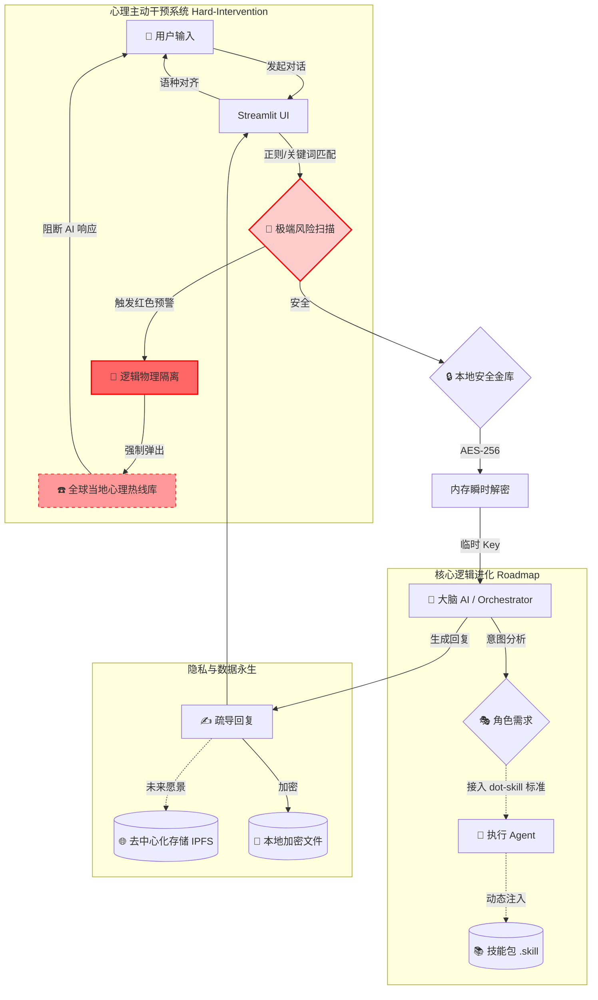

<div align="center">
  
  
  # 🐾 PsychClaw 4.1
> **"People leave. Skills don't."** —— 基于多智能体协同的永久心理防御中枢。

[](https://opensource.org/licenses/MIT)


## 🌟 项目介绍：PsychClaw 是什么？

PsychClaw 不仅是一个聊天机器人，更是一个致力于构建**“永久心理防御中枢 (Permanent Psychological Defense Hub)”**的开源实验。

---

## 为什么会有这个项目？

“代码是冰冷的，但它能承载最真实的温度。”
PsychClaw 并非诞生于象牙塔。它的灵感源于开发者的真实体悟：当生理痛苦达到极限时，心理防线往往随之瓦解。
但在我们的社会环境中，心理问题常被视为“矫情”或“软弱”，人们习惯于压抑情感，对专业的心理咨询存在天然的抗拒与羞耻感。
---
我希望构建一个这样的系统：

消解病耻感：通过 AI 这种非人化的中介，让人们在没有压力的情况下正视自己的情绪。

私密的避风港：利用 AES-256 加密，确保一个人的痛苦只属于自己，不会成为社交谈资。

物理干预防线：在社会支持系统缺位时，提供最后一道全球性的热线救援机制。

---

### 核心痛点与协作契机：
目前，PsychClaw 4.1 版本已经跑通了核心逻辑，但受限于开发者的工程能力（高三学生，编程基础薄弱），目前的“技能注入”采用的是简陋的本地 Markdown 提取，缺乏弹性和标准。

**我们极度渴望接入 `dot-skill` 的开放标准**，将 PsychClaw 的心理学智慧真正转化为可复用、可传播的 `.skill` 角色包，实现从“AI 原型”到“工业级心理 Agent”的跨越。
---

## 🧑‍💻 开发者自白：关于“灵魂”与“肉体”

我是本项目的主理人，目前是一名中国的高三学生。

* **灵魂 (The Soul)**：本项目的逻辑架构、防御策略、以及人文关怀初衷由我定义。
* **肉体 (The Body)**：由于备考时间有限，本项目的具体代码实现主要由我与 **Gemini (AI)** 深度协作生成。

**我深知 AI 生成的代码在工程规范上尚有巨大提升空间。因此，我决定将本项目完全开源，并恳请社区大佬进行“粉碎性重构”。**

---

## ✨ 核心特性

* 🧠 **Orchestrator 编排模式**：支持 Grok/DeepSeek 作为总控大脑，调度本地 Agent 执行复杂任务。
* 🔒 **银行级金库**：所有 API Key 经 **AES-256** 加密存储于本地，开发者也无法获取你的隐私。
* 🌐 **镜像语言对齐**：原生支持多语种自适应，确保心理沟通无障碍。
* 🚨 **极端风险物理干预**：内置毫秒级风险扫描协议，在极端时刻强制切断对话并触发救援引导。
* 🎭 **多角色技能池**：(规划中) 深度接入 `dot-skill` 标准，实现心理学大师经验的动态注入。

---

## 🛠️ 当前技术栈 (Tech Stack 1.0)

虽然代码实现尚显稚嫩，但项目坚持了硬核、安全、协同的技术路线：

| 模块 | 技术实现 | 关键特性 | 现状说明 |
| :--- | :--- | :--- | :--- |
| **前端 UI** | **Streamlit** | 极速响应，对话式交互 | 逻辑与 UI 高度耦合在 `app.py`，急需解耦。 |
| **大脑 AI** | **Grok / DeepSeek-V3** | 高智商决策，多语种思维 | 通过 API 调用，作为总控 Orchestrator。 |
| **执行 Agent** | **OpenClaw (或 Claude-Haiku)** | 本地工具调用，快速执行 | 负责执行具体指令，如本地技能检索。 |
| **核心安全** | **AES-256 (CBC 模式)** | 银行级本地加密，私钥保护 | API Key 加密存储，仅在内存中瞬间解密。**已跑通。** |
| **技能检索 (RAG)** | **本地 Markdown 提取** | 轻量级、无向量库依赖 | **简陋原型**。计划替换为 `dot-skill` 标准协议。 |
| **风险控制** | **毫秒级关键词扫描** | 物理隔断，强制救援展示 | 针对极端情绪的最后一道防线。 |

---

### 🧩 核心业务流程图 (Final Version)


---

📜 开源协议
本项目采用 MIT License。你可以自由地重改、分发或重写。

愿代码的温度能穿透高压与孤独。

---

## 🛠️ 协作请求：重构计划

我授权并欢迎任何人对本项目进行重写。目前的重构目标包括：

1.  **接入 dot-skill 标准**：将现有的 Markdown 提取逻辑升级为标准的 `dot-skill` 技能包调用。
2.  **代码解耦**：将目前堆叠在 `app.py` 中的逻辑进行模块化拆分（如逻辑层与 UI 层分离）。
3.  **性能优化**：优化 AES 本地加解密的内存占用。
4.  **UI/UX 升级**：让 Streamlit 界面更具治愈感。

---

## 📦 快速开始

```bash
# 克隆仓库
git clone [https://github.com/](https://github.com/)[你的用户名]/PsychClaw.git

# 安装依赖
pip install streamlit cryptography openai requests

# 启动防线
streamlit run app.py
```
安全提示：首次运行生成的 .key 文件包含你的加密秘钥，请务必妥善保管，切勿泄露给任何人。
---

## 💡 参与贡献与脑暴 (Brainstorming)

PsychClaw 是一块实验田，我接受并欢迎任何“疯狂”的设想。你可以通过以下方式参与：
1. **Submit a PR**: 针对代码结构的解耦与重构。
2. **Open an Issue**: 提出你认为心理防御 Agent 应该具备的新功能。
3. **Skill Distillation**: 帮我们把更多心理学专著“蒸馏”成 `.skill` 配置文件。

**主理人寄语：** 每一个 Pull Request 都是对孤独灵魂的一次数字援护。

---

### ⚖️ 免责声明 (Disclaimer)

1. **非医疗建议**：PsychClaw 提供的所有内容均为 AI 生成，仅供参考，不构成任何医疗建议或精神诊断。如有严重心理困扰，请务必寻求专业医疗机构帮助。
2. **数据责任**：本项目为本地运行工具，开发者不存储、不上传、不接触用户的任何私密数据。用户需自行保管解密私钥（.key 文件）。
3. **合规使用**：请在所在国家/地区的法律框架内使用本工具。

---

<div align="center">
  
  <br>
  <i>"既然现实无法重构，那就让我们在代码里，蒸馏出那一丝救赎的可能。"</i>
  <br><br>
  <b>Stay rebellious. Stay Clawed. 🐾</b>
</div>
